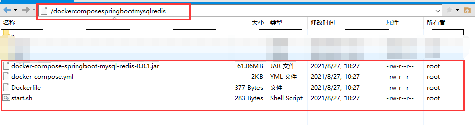

# docker-compose-springboot-mysql-redis

#### 介绍
测试docker-compose、MySQL、Redis; springboot同时使用mysql和Redis，全部容器化（mysql数据挂载到宿主机持久化）。

#### docker-compose install（前提先安装了-->docker:20.10.8）
```shell
curl -L https://get.daocloud.io/docker/compose/releases/download/1.29.2/docker-compose-`uname -s`-`uname -m` -o /usr/local/bin/docker-compose 
```
```shell
chmod +x /usr/local/bin/docker-compose
```
#### maven打包之后，拷贝到linux服务器（centos7）
linux centos7 新建目录：
```shell
mkdir dockercomposespringbootmysqlredis
```
xftp拷贝: jar包、Dockerfile、docker-compose.yml、start.sh 四个文件到新建的dockercomposespringbootmysqlredis目录


#### 当前目录运行（启动）
```shell
. start.sh
```
#### 模拟假数据
Navicat 链接docker 的 mysql数据库，ip你自己的linux，端口：3336

执行假数据的SQL文件：docker-compose-springboot-mysql-redis\src\main\resources\user-insert.sql

#### 测试URL（实际自己的IP）
```shell
curl 154.8.232.150/:8899/dockercomposespringbootmysqlredis/user/getUserInfo?userId=1123598821738675204
```
#### 浏览器打开（腾讯云等，需要开放防火墙打开8899/3336/7379端口）
http://154.8.232.150/:8899/dockercomposespringbootmysqlredis/user/getUserInfo?userId=1123598821738675204

#### 当前目录运行（停止）
```shell
. stop.sh
```
#### 后记
mysql docker端口3306，外部端口3336，账号root，密码root，数据库docker-compose-springboot-mysql-redis

Redis docker端口6379，外部端口7379，账号root，密码：root

springboot docker端口8899，外部端口8899，根context-path: /dockercomposespringbootmysqlredis